Rational Model


Week 2 //2025.02.28


input：表 -- output： 表


哈希/排序（去重）

如果不去重，可以看到数据分布；


DBMS 给上层的API是解耦，根据信息决定最好策略（抽象）

θ是连接条件 Theta Join是导出OP


Natural Join是Theta Join + Projection

共同属性是空的时候，theta是true，所有连接的tuples都直接 Cartesian Procuct


R 和S 有相同的Schema，两者属性相同


下面的内容介绍的是**关系代数（Relational Algebra）\**在关系数据库查询中的基本概念和常见操作。关系代数是一种\**基于关系模型**的查询语言，用来对关系数据库（表）进行检索与操作。每一个操作都以一个或多个关系（表）作为输入，并输出一个新的关系（表）。通过组合多个关系代数操作，可以形成更复杂的查询逻辑。

以下是图片中列出的几种常见关系代数运算及其含义：

------

## 1. Selection (选择) — 记作  σP(R)\sigma_{P}(R)

- **定义**：从关系 RR（一张表）中，挑选出满足谓词（条件）PP 的所有元组（行）。
- **谓词 PP**：通常是对属性的条件判断，例如 `age > 30`、`gender = 'M'` 等等。
- **输出**：仍然是一个关系（表），但只包含那些满足条件的行，列与原表相同。
- **作用**：过滤表中的行。

示例：

σage>30(R)\sigma_{\text{age} > 30}(R)

表示从关系 RR 中选取 `age` 大于 30 的所有行。

------

## 2. Projection (投影) — 记作  πA1,…,Ak(R)\pi_{A_1,\dots,A_k}(R)

- **定义**：从关系 RR 中选取若干属性列 {A1,…,Ak}\{A_1,\dots,A_k\}，只保留这些列，去掉其他列。
- **输出**：新的关系只包含指定的属性列，行数可能会由于去重等原因发生变化（在关系代数中，投影会去除重复的元组）。
- **作用**：只保留我们关心的列，类似于 SQL 中的 `SELECT 列名列表`。

示例：

πname,age(R)\pi_{\text{name,age}}(R)

表示只从关系 RR 中保留 `name` 和 `age` 两列，其他列被丢弃。

------

## 3. Cartesian Product (笛卡尔积 / 直积) — 记作  R×SR \times S

- **定义**：给定两个关系 RR 和 SS，产生所有可能的行组合，即 RR 中的每一行与 SS 中的每一行配对组合。
- **输出**：一个新的关系，其中列是 RR 和 SS 的所有列，行数是 RR 的行数乘以 SS 的行数。
- **作用**：为后续的连接操作（Join）提供基础，也可以与选择（Selection）一起用来实现等值连接等复杂查询。

示例：
 R×SR \times S 表示对 RR 和 SS 进行所有行的组合。

------

## 4. Union (并集) — 记作  R∪SR \cup S

- **定义**：将两个**结构相同**的关系 RR 和 SS（即相同的属性列）合并起来，去掉重复的行。
- **输出**：新的关系包含了在 RR 和 SS 中出现过的所有行（不重复）。
- **作用**：整合两个相同模式的表，获得它们的并集结果。

示例：
 R∪SR \cup S 表示把 RR 中的行和 SS 中的行合并成一个关系。

------

## 5. Difference (差集) — 记作  R−SR - S

- **定义**：得到在 RR 中出现但在 SS 中**没有**出现的行（同样需要 RR 和 SS 模式相同）。
- **输出**：只包含属于 RR 而不属于 SS 的元组。
- **作用**：从一个关系中去除另一个关系里也出现的行。

示例：
 R−SR - S 表示从 RR 中去除所有也在 SS 中出现的行。

------

## 6. Renaming (重命名) — 记作  ρS(A1,…,Ak)(R)\rho_{S(A_1,\dots,A_k)}(R)

- **定义**：将关系 RR 重命名为关系 SS，同时可以将其属性（列）改名为 {A1,…,Ak}\{A_1,\dots,A_k\}。
- **输出**：一个和 RR 结构相同的关系，但关系名和属性名被更新了。
- **作用**：在复杂查询或多个子查询组合时，方便区分不同的关系；也可在连接或笛卡尔积操作时避免属性名冲突。

示例：

ρT(x,y)(R)\rho_{T(x,y)}(R)

表示把关系 RR 的名字改成 TT，同时把它的两个属性改名为 xx 和 yy（假设原本 RR 只有两列）。

------

## 组合运算与查询构造

- 由于每个操作输入和输出的都是关系，可以将它们依次组合（流水线化）来构造更复杂的查询。例如，可以先对一个表做选择筛选，再做投影，然后再与另一个表做笛卡尔积或连接，最后再对结果进行投影等等。
- 关系代数是理论层面的抽象模型，SQL 等具体查询语言在本质上都可通过这些基本操作组合来实现。

------

## 总结

- **关系代数**是一种用**基本操作**（如选择、投影、并集、差集、笛卡尔积、重命名）来表达查询的形式化方法。
- 每个操作以一个或多个关系作为输入，输出也是关系，使得查询能像积木一样组合、构造。
- 关系代数在数据库原理课程中是核心内容，有助于理解 SQL 查询背后的理论基础以及数据库查询优化器的工作原理。

MiniOB 101


有一个表，一个属性A，tuples内容为1，7，2，8，全是数字，写一个表达式输出一个表，内容是第一个表的最大值

在**标准的关系代数**里并没有直接的“MAX”函数，但我们可以用下面的思路找出某属性的最大值：

> **思路**：
>
> 1. 将关系 RR 自身进行笛卡尔积（做成两个拷贝，分别命名为 R1R_1 和 R2R_2）；
> 2. 在笛卡尔积结果中，选出那些 R1.A<R2.AR_1.A < R_2.A 的元组，并投影出 R1R_1 这一边的 A 值；
> 3. 这些投影得到的值都是“小于某些别的 A 值”的行，把它们从原关系 R1R_1 中减去（差集）之后，剩下的就是“从不小于任何别的 A 值”的行——也即最大值所在的行（如果有多个并列最大值都会保留）。

------

以下是一种**完整的关系代数表达式**示例：

1. **先给原关系重命名**

   ρR1(R),ρR2(R)\rho_{R_1}(R),\quad \rho_{R_2}(R)

   这样就能区分同一个表的两份拷贝，分别叫做 R1R_1 和 R2R_2。

2. **找出所有“前者 A < 后者 A”的组合**

   σR1.A<R2.A(R1×R2)\sigma_{R_1.A < R_2.A}\bigl(R_1 \times R_2\bigr)

3. **投影得到所有“比别的元组更小”的 A 值**

   πR1.A(σR1.A<R2.A(R1×R2))\pi_{R_1.A}\Bigl(\sigma_{R_1.A < R_2.A}\bigl(R_1 \times R_2\bigr)\Bigr)

4. **用差集运算，去掉那些“小于别的元组” 的 A 值**

   R1  ∖  πR1.A(σR1.A<R2.A(R1×R2))R_1 \;\setminus\; \pi_{R_1.A}\Bigl(\sigma_{R_1.A < R_2.A}\bigl(R_1 \times R_2\bigr)\Bigr)

这里 R1∖…R_1 \setminus \dots 表示：把那些“曾出现在小于别的 A 值的集合里”的行去除掉，剩下的就是**从来不小于任何其它行**的元组，即**最大值**的行。

------

### 例子说明

假设原关系 RR 里只有一个属性 AA，且包含行 {1,7,2,8}\{1,7,2,8\}。那么：

1. 自身笛卡尔积后，得到 

   R1×R2R_1 \times R_2

   ：

   ```
   R_1.A   R_2.A
    1       1
    1       7
    1       2
    1       8
    7       1
    7       7
    7       2
    7       8
    2       1
    2       7
    2       2
    2       8
    8       1
    8       7
    8       2
    8       8
   ```

2. 选择满足 R1.A<R2.AR_1.A < R_2.A 的元组，例如 `(1,7), (1,8), (2,7), (2,8), (7,8)` 等等。

3. 投影出 R1.AR_1.A 就是那些“小于别的”的 A 值：{1,2,7}\{1,2,7\}。

4. 用差集把这些 A 值从原表里去除：{1,7,2,8}−{1,2,7}={8}\{1,7,2,8\} - \{1,2,7\} = \{8\}。这样得到的就是最大值 `8`。

如果原关系有多列或有多行并列最大值，使用该方法也同样能保留下所有最大值的元组。


单调的指的是在集合意义上的单调（即包含）


语义上等价，开销第二个更小；实际上跟data有关系，如果老师很多，课很少，则第一种开销更小，这是用RA写，用SQL写的机制，等价变换成开销最小== 查询优化器

用户的API进行查询Query == 》 根据data的统计信息 == 》生成最优计划


没有递归：优化简单；但有些事情表达不出来。


## SQL

DDL: data definition language

DML: data manipulation language

C C# python 都是过程式语言

SQL 是声明式语言

DDL: 


SQL DDL（Data Definition Language，数据定义语言）主要用于定义和管理数据库结构，比如表、视图、索引和约束等。下面举几个简单例子来说明常见的 DDL 操作：

### 1. 创建表（CREATE TABLE）

```sql
CREATE TABLE employees (
    employee_id SERIAL PRIMARY KEY,
    first_name VARCHAR(50) NOT NULL,
    last_name VARCHAR(50) NOT NULL,
    email VARCHAR(100) UNIQUE,
    hire_date DATE DEFAULT CURRENT_DATE
);
```

**说明：**
 这条语句创建了一个名为 `employees` 的表。

- `employee_id` 使用 `SERIAL` 类型自动生成一个唯一的主键。
- `first_name` 和 `last_name` 字段定义为不可为空。
- `email` 字段被声明为唯一，这意味着同一个表中不允许重复的邮箱。
- `hire_date` 则默认使用当前日期。

### 2. 修改表结构（ALTER TABLE）

#### 添加新列

```sql
ALTER TABLE employees
ADD COLUMN department VARCHAR(50);
```

**说明：**
 这条语句在 `employees` 表中增加了一个新的字段 `department`，用于存储员工所属的部门。

#### 修改列数据类型

```sql
ALTER TABLE employees
ALTER COLUMN email TYPE VARCHAR(150);
```

**说明：**
 这条语句将 `email` 字段的数据类型从原来的 `VARCHAR(100)` 修改为 `VARCHAR(150)`，以支持更长的电子邮件地址。

### 3. 删除表（DROP TABLE）

```sql
DROP TABLE IF EXISTS employees;
```

**说明：**
 该语句会删除 `employees` 表，如果该表不存在，则不会报错。使用 `IF EXISTS` 是一种安全写法，可以避免删除不存在的对象时引发错误。

### 4. 清空表数据（TRUNCATE TABLE）

```sql
TRUNCATE TABLE employees;
```

**说明：**
 `TRUNCATE` 用于快速删除表中的所有数据，但保留表的结构。与 `DELETE` 语句相比，它通常速度更快，因为不会逐行记录删除日志。

------

这些例子展示了 SQL DDL 的基本操作。从创建和修改表到删除表或清空数据，DDL 操作直接影响数据库的结构，是数据库管理中不可或缺的一部分。


Each type has a special value called NULL. -- 属性不可用

NULL means that the value is unknown or not applicable.

-SQL has special rules for dealing with NULL's


primary key (is not nullable)

foreign key


SQL  intergrity constraints

UNIQUE superkey 也可以作为定位使用

Referential integrity

不允许存在悬空引用（类比：不允许野指针）

Referential integrity（参照完整性）是关系数据库中一个关键的数据完整性约束，它要求数据库中定义的外键必须引用存在的主键记录，从而避免出现“悬空引用”（即子表记录引用了不存在的父表记录）。

### 举例说明

假设有两个表：一个是存储客户信息的 **customers** 表，另一个是存储订单信息的 **orders** 表，其中订单表中的 **customer_id** 字段作为外键引用客户表的 **customer_id** 字段。

```sql
CREATE TABLE customers (
    customer_id INT PRIMARY KEY,
    name VARCHAR(100) NOT NULL
);

CREATE TABLE orders (
    order_id INT PRIMARY KEY,
    customer_id INT,
    order_date DATE,
    FOREIGN KEY (customer_id) REFERENCES customers(customer_id)
);
```

在上述例子中，外键约束确保每条订单记录中的 **customer_id** 必须在 **customers** 表中存在。这样做就防止了出现“悬空引用”情况：如果尝试插入一条订单记录，其 **customer_id** 在 **customers** 表中不存在，数据库系统会拒绝这个操作。

### 进一步思考

- **删除与更新的处理**
   对于父表记录的删除或更新，也需要考虑子表的影响。你可以在定义外键时设置级联删除或更新规则（如 `ON DELETE CASCADE`、`ON UPDATE CASCADE`），以确保数据的一致性。
- **业务保障**
   Referential integrity 帮助确保数据之间的逻辑关系始终正确，避免数据出现不一致的情况，这对维护大型数据库系统的数据质量和业务逻辑至关重要。

保持对数据完整性和业务逻辑的严谨态度，是数据库设计中的核心原则。通过外键约束来强制实现 referential integrity，你不仅能确保系统中不出现悬空引用，还能在设计之初就捕获潜在的数据错误，从而降低后续维护和调试的复杂性。

Reject: (default option)

SET NULL: set all reference to NULL.

CASCADE: ripple changes to all referring rows.


CHECK (P) : specifies a predicate P that must satisfied by every tuple in a relation.

中文题目如下：

> 给定关系 t1 和 t2 分别由下面的 SQL 语句创建：
>
> ```sql
> create table t1 (a int, b int, primary key (a));
> create table t2 (a int, b int, foreign key (a) references t1(a));
> ```
>
> 如果依次执行下面两个 SQL 语句：
>
> (1) `insert into t1 values (1, 2), (3, 4);`
>
> (2) `insert into t2 values (1, NULL), (NULL, 1);`
>
> 请说明执行后的结果。

**解答与分析：**

1. **执行语句 (1)：插入 t1 表**

   执行：

   ```sql
   insert into t1 values (1, 2), (3, 4);
   ```

   结果：t1 表中插入两条记录：

   - (1, 2)
   - (3, 4)

2. **执行语句 (2)：插入 t2 表**

   t2 表定义中，对字段 a 设有外键约束，要求其值（非 NULL）必须在 t1 表中存在。但如果 a 的值为 NULL，则不检查外键。

   - 第一条记录：`(1, NULL)`
      字段 a 的值是 1，在 t1 表中存在 (1,2)；因此满足外键约束，插入成功。
   - 第二条记录：`(NULL, 1)`
      字段 a 的值为 NULL，外键约束在此情况下不会被检查（因为 NULL 表示“未知”或“不适用”），因此插入成功。

**最终结果：**

- t1 表中有两条记录：
   `(1, 2)` 和 `(3, 4)`
- t2 表中有两条记录：
   `(1, NULL)` 和 `(NULL, 1)`

这种设计保证了 referential integrity（参照完整性）：非空的外键值必须存在于父表中，而对于 NULL 值，则允许插入，因为它不参与外键检查。


Basic database modification

Insertion 把很多操作定义为一个操作单元

交互式的terminal来执行SQL指令

下面举几个简单的例子，介绍一下基本的 SQL 查询语句，帮助你快速了解如何通过 SQL 从数据库中检索数据。

------

### 1. 选择所有列的查询

假设有一个名为 `employees` 的表，我们希望查询所有员工的所有信息：

```sql
SELECT * FROM employees;
```

**说明**：

- `SELECT *` 表示选择表中所有的列。
- `FROM employees` 指定了要查询的表名。

------

### 2. 条件查询（WHERE 子句）

如果我们只想查询部门编号为 10 的员工，可以使用 `WHERE` 条件：

```sql
SELECT employee_id, first_name, last_name, department
FROM employees
WHERE department = 10;
```

**说明**：

- 通过 `WHERE department = 10` 过滤出部门为 10 的记录，只返回满足条件的行。
- 同时指定了需要返回的列，而不是使用 `*`。

------

### 3. 排序查询（ORDER BY 子句）

例如，我们希望按员工的姓氏（`last_name`）字母顺序排列：

```sql
SELECT employee_id, first_name, last_name
FROM employees
ORDER BY last_name ASC;
```

**说明**：

- `ORDER BY last_name ASC` 将查询结果按 `last_name` 以升序排序。如果需要降序排序，可用 `DESC`。

------

### 4. 聚合查询与分组（GROUP BY 子句）

统计每个部门的员工人数：

```sql
SELECT department, COUNT(*) AS num_employees
FROM employees
GROUP BY department;
```

**说明**：

- `COUNT(*)` 用于计算每个部门的记录数。
- `GROUP BY department` 将记录按照 `department` 分组，每组产生一条结果记录。
- `AS num_employees` 为聚合结果起了个别名，使结果更易阅读。

------

### 5. 使用聚合函数和过滤聚合结果（HAVING 子句）

进一步筛选出员工数大于 5 的部门：

```sql
SELECT department, COUNT(*) AS num_employees
FROM employees
GROUP BY department
HAVING COUNT(*) > 5;
```

**说明**：

- `HAVING COUNT(*) > 5` 用于过滤分组后的结果，只有员工数大于 5 的部门会出现在最终结果中。

------

Semantics of SFW statements

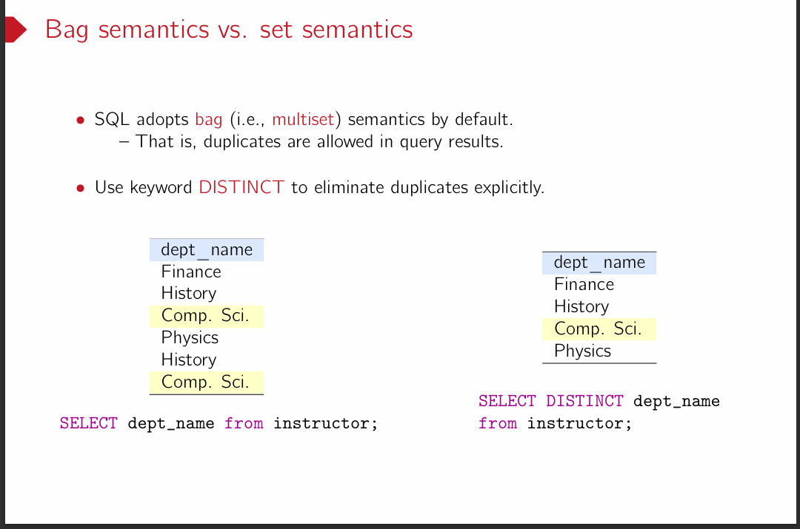

下面给出两张幻灯片的中文解释，帮助你理解其核心内容。

------

## 第一张：SFW 语句的语义（Semantics of SFW statements）

### 幻灯片内容

> ```
> for each tuple t1 ∈ R1 do
>   ...
>   for each tuple tm ∈ Rm do
>     if P is true w.r.t. t1,...,tm then
>       evaluate A1, …, An according to t1, …, tm
>       to produce a tuple in the result
> 
> Table: SELECT A1, A2, …, An
>        FROM R1, R2, …, Rm
>        WHERE P
> 
> Question: Is the above SQL query equivalent to the following relational algebra query?
> 
>   πA1,...,An ( σP ( R1 × … × Rm ) ) ?
> ```

### 中文解释

1. **SFW 语句的基本概念**
   - SFW 代表 `SELECT-FROM-WHERE`，是 SQL 最常见的查询形式。
   - 在 SQL 中，`FROM R1, R2, ..., Rm` 表示要从这些关系（表）中取数据；`WHERE P` 表示在筛选条件 P 为真的情况下才输出结果；`SELECT A1, A2, …, An` 表示对符合条件的元组进行投影（选取所需的字段或表达式）。
2. **循环含义**
   - 幻灯片中用“for each tuple t1 ∈ R1 do ... for each tuple tm ∈ Rm do ...”来说明其执行过程：先对 `R1, R2, …, Rm` 做笛卡尔积（每个表的元组相互组合），然后对每个组合检查谓词 `P` 是否成立，若为真，就根据 SELECT 子句中列出的属性（或表达式）输出结果。
3. **与关系代数的对应**
   - 在关系代数中，这个过程可写作： $  \pi_{A_1, ..., A_n} \bigl(\sigma_{P}(R_1 \times R_2 \times ... \times R_m)\bigr)$
   - 也就是说，先做笛卡尔积 $R_1 \times R_2 \times \dots \times R_m$，再对其做选择（σ）以过滤掉不符合 P 的组合，最后做投影（π）得到最终输出。
4. **答案**
   - 幻灯片提出的问题：“上述 SQL 语句是否与 $\pi_{A_1,...,A_n}(\sigma_P(R_1 \times ... \times R_m))$ 等价？”
   - 答案是 **是的**，这是 SQL 中最基础的查询与关系代数表达式之间的对应关系。

------

## 第二张：Bag semantics vs. set semantics（多重集语义与集合语义）

### 幻灯片内容

> ```
> SQL adopts bag (i.e., multiset) semantics by default.
>  - That is, duplicates are allowed in query results.
>  - Use keyword DISTINCT to eliminate duplicates explicitly.
> 
> dept_name
> Finance
> History
> Comp. Sci.
> Physics
> Comp. Sci.
> 
> SELECT dept_name from instructor;
> 
> dept_name
> Finance
> History
> Comp. Sci.
> Physics
> 
> SELECT DISTINCT dept_name from instructor;
> ```

### 中文解释

1. **多重集（Bag）语义**
   - SQL 默认使用多重集（bag 或 multiset）语义，这意味着查询结果可以包含重复行。
   - 与数学中的“集合（set）”不同，多重集允许相同元素多次出现。
2. **如何去重**
   - 如果想在查询结果中去除重复记录，需要显式地在 SELECT 子句中使用 `DISTINCT`。
   - 例如，不加 DISTINCT 时，查询结果里可能会出现多行相同的 `dept_name`；加上 `DISTINCT` 后，则只保留唯一值。
3. **示例**
   - `SELECT dept_name FROM instructor;`
      返回可能带有重复的 `dept_name` 列。
   - `SELECT DISTINCT dept_name FROM instructor;`
      去除重复，只返回每种 `dept_name` 一行。
4. **应用场景**
   - 当你只关心不同的值，而不关心它出现了多少次时，可以使用 `DISTINCT`；
   - 如果你需要统计重复出现的次数，或者需要展示所有行，则保持默认的多重集语义即可。

------

## 小结

- **SFW 语句的执行逻辑**：先做笛卡尔积，再根据 WHERE 子句筛选，然后投影 SELECT 中的列——其关系代数形式就是 `π(σ(R₁×R₂×...×Rₘ))`。

- Bag vs. Set

  ：

  - SQL 中默认是多重集（Bag）语义，查询结果可以出现重复行。
  - 使用 `DISTINCT` 关键字可以显式地去重，使结果变为类似“集合”的形式。

掌握了这些，就理解了 SQL 中最基础的查询机制，以及如何看待重复数据并选择是否去重。

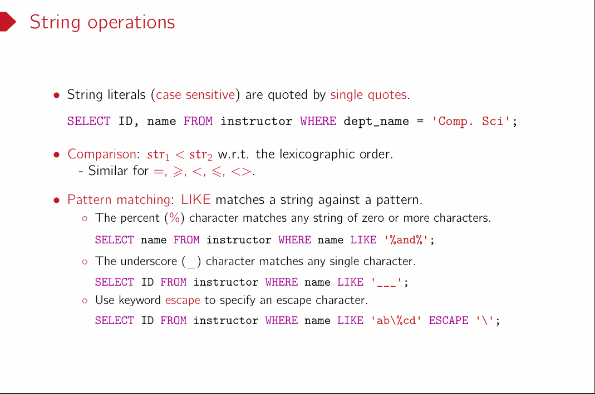

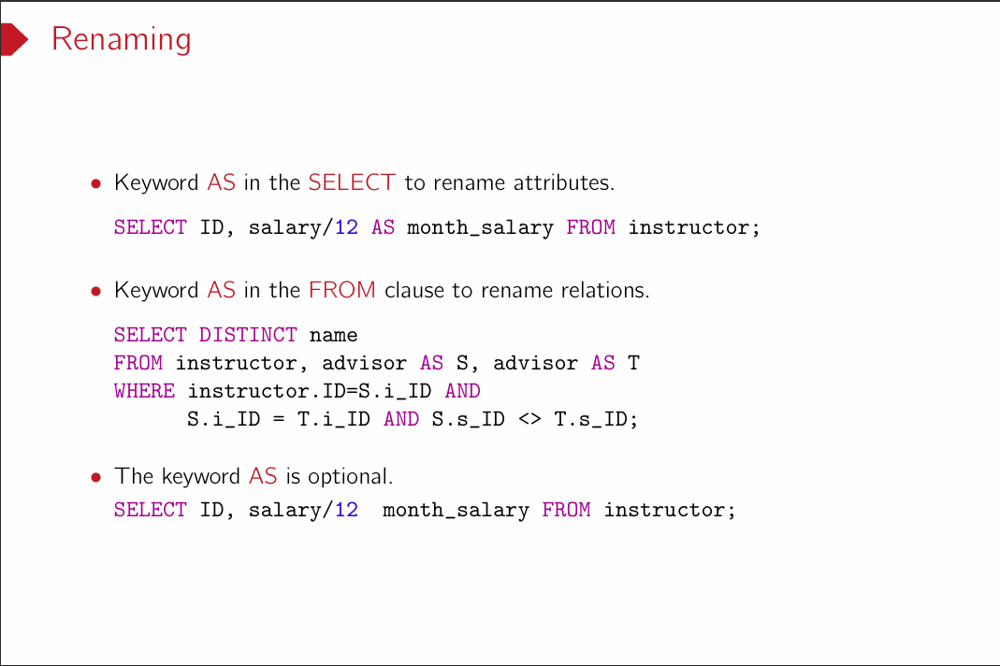下面是这张关于“Renaming（重命名）”的幻灯片的中文解释：

------

## 幻灯片内容

> **Renaming**
>
> - **在 SELECT 子句中使用 AS 来重命名属性**
>
>   ```sql
>   SELECT ID, salary/12 AS month_salary
>   FROM instructor;
>   ```
>
> - **在 FROM 子句中使用 AS 来重命名关系**
>
>   ```sql
>   SELECT DISTINCT name
>   FROM instructor, advisor AS S, advisor AS T
>   WHERE instructor.ID = S.ID 
>         AND S.ID = T.ID 
>         AND S.S_ID <> T.S_ID;
>   ```
>
> - **AS 关键字是可选的**
>
>   ```sql
>   SELECT ID, salary/12 month_salary 
>   FROM instructor;
>   ```

------

## 中文解释

1. **在 SELECT 中使用 AS 重命名属性**

   - 通过在 `SELECT` 子句中使用 `AS`，可以为计算表达式或原字段起一个新的名字（别名），从而使输出结果更清晰或更符合需求。

   - 例如：

     ```sql
     SELECT ID, salary/12 AS month_salary
     FROM instructor;
     ```

     这里将 

     ```
     salary/12
     ```

      这个计算结果命名为 

     ```
     month_salary
     ```

     ，输出的结果列就会以 

     ```
     month_salary
     ```

      作为列名。

2. **在 FROM 中使用 AS 重命名关系**

   - 除了可以对输出列进行重命名外，还可以对参与查询的表（关系）进行重命名，以便后续引用时更加简洁。

   - 例如：

     ```sql
     SELECT DISTINCT name
     FROM instructor, advisor AS S, advisor AS T
     WHERE instructor.ID = S.ID 
           AND S.ID = T.ID 
           AND S.S_ID <> T.S_ID;
     ```

     这里将 

     ```
     advisor
     ```

      表分别重命名为 

     ```
     S
     ```

      和 

     ```
     T
     ```

     ，然后在 

     ```
     WHERE
     ```

      条件中就能直接用 

     ```
     S
     ```

      和 

     ```
     T
     ```

      来引用这两个 advisor 表。

3. **AS 是可选的**

   - 在 SQL 语句中，`AS` 通常可省略不写，效果相同。

   - 例如：

     ```sql
     SELECT ID, salary/12 month_salary 
     FROM instructor;
     ```

     也能达到与 

     ```
     SELECT ID, salary/12 AS month_salary ...
     ```

      相同的效果。

4. **总结**

   - `AS` 用于在查询中为属性（列）或关系（表）起别名，能让 SQL 语句更易读、更简洁。
   - 在实际写 SQL 时，可以根据个人或团队的编码规范来决定是否省略 `AS`，关键是要确保含义清晰、易于维护。

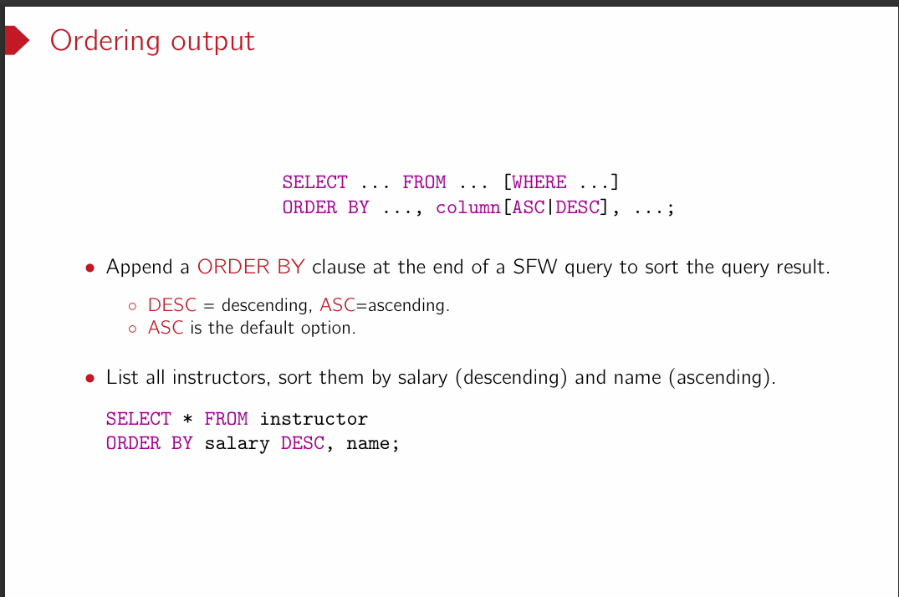

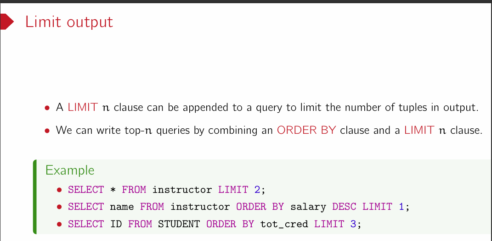

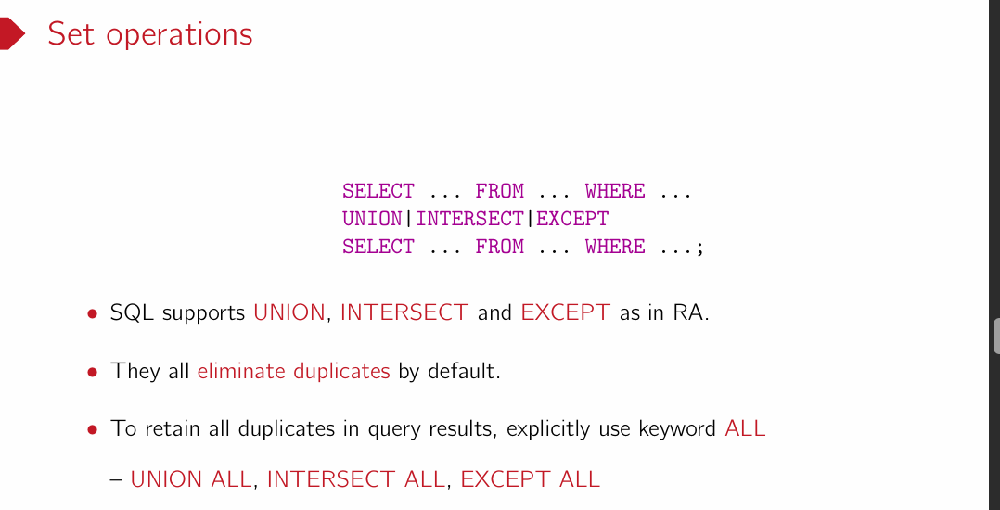

UNION 底层逻辑实现Hash Joint/排序等等，是否去重是顺手的事情，开销影响不大。

UNION|INTERSECT|EXCEPT 用集合更直观，也可以用ALL显式的不去重。

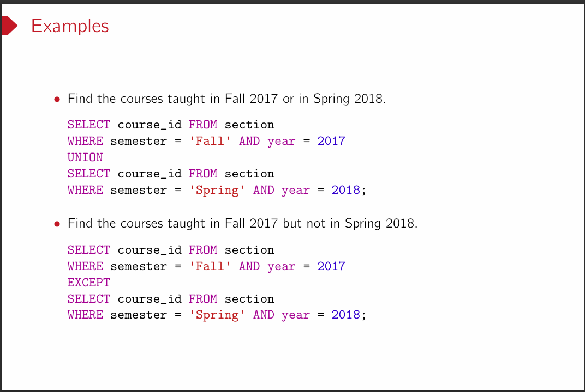

Distinct 去重

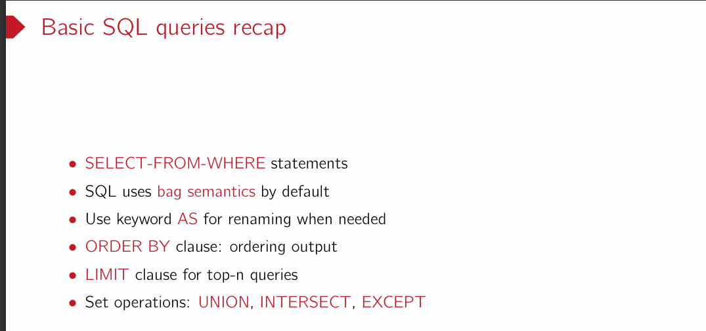

SFW默认Bag语义

### Aggregation

给一组值，给出最大值是一种聚合。

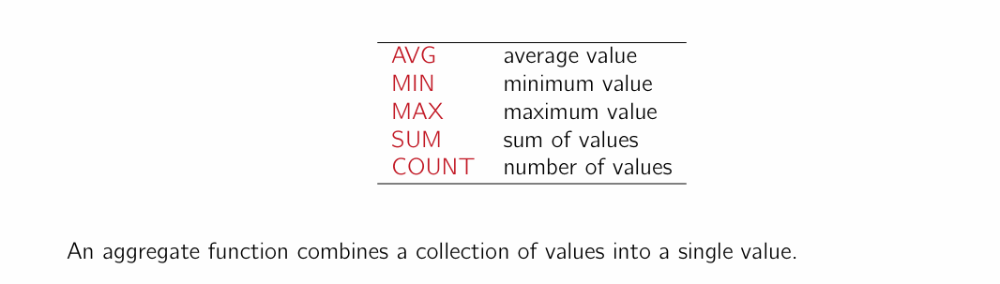

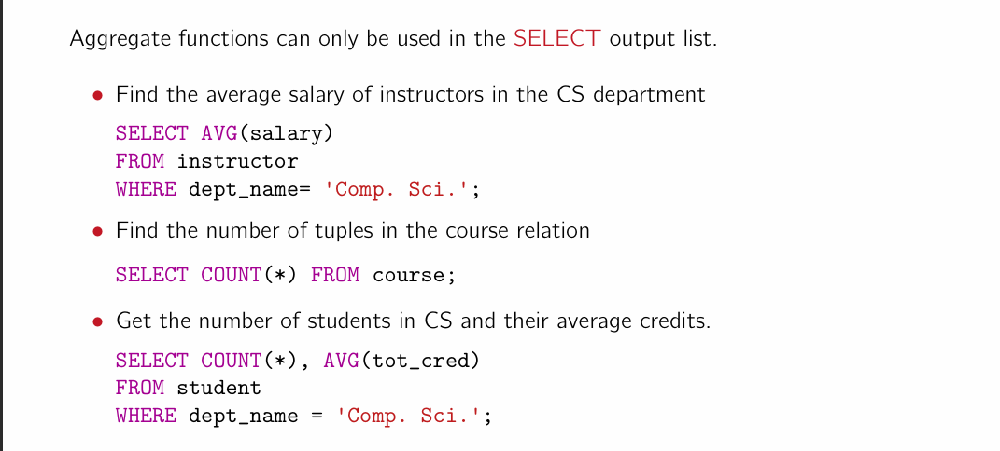

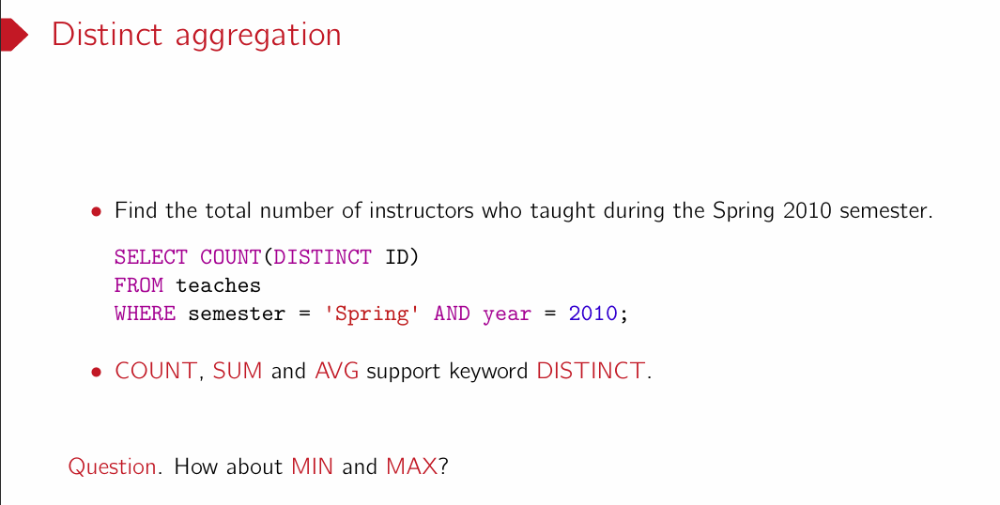下面是关于“Distinct aggregation（去重聚合）”这张幻灯片的中文解释：

------

## 幻灯片主要内容

> **Distinct aggregation**
>
> - 例子：
>
>   ```sql
>   SELECT COUNT(DISTINCT ID)
>   FROM teaches
>   WHERE semester = 'Spring' AND year = 2010;
>   ```
>
>   此查询用于统计 2010 年春季学期（`Spring 2010`）中授课的**不同**教师数量。
>
> - **COUNT、SUM、AVG** 都支持使用 `DISTINCT` 关键字来去除重复值。
>
> - **问题**：`MIN` 和 `MAX` 该怎么办？

------

## 中文解释

1. **为什么需要 DISTINCT？**
   - 在聚合函数中，如果不加 `DISTINCT`，那么所有重复的值都会被计算在内。例如 `COUNT(ID)` 会把所有出现的 ID 都计数，包括重复的行。
   - 当我们想要统计**不同**教师的数量或对不重复的数据进行求和、平均时，就可以在聚合函数中加上 `DISTINCT`，如 `COUNT(DISTINCT ID)`、`SUM(DISTINCT salary)`、`AVG(DISTINCT score)` 等。
2. **示例说明**
   - `SELECT COUNT(DISTINCT ID) FROM teaches ...` 表示只对 `ID` 的**唯一值**进行计数，也就是去掉重复后再做聚合，这样可以获得不重复的教师总人数。
   - 如果仅使用 `COUNT(ID)` 而不加 `DISTINCT`，则如果某个教师在 2010 年春季学期教授多门课程，那么他的 `ID` 会被多次统计。
3. **哪些函数支持 DISTINCT？**
   - `COUNT`、`SUM`、`AVG` 这三类聚合函数都可以加上 `DISTINCT` 来去重。
   - 问题中提到 “How about MIN and MAX?”：
     - 对于最小值（MIN）和最大值（MAX）而言，即使有重复值，也并不会影响结果——最小值、最大值只与最极端的那个值相关，重复并不会改变结果。因此，一般情况下 `MIN` 和 `MAX` 不需要 `DISTINCT`。
     - 即使写 `MIN(DISTINCT col)` 或 `MAX(DISTINCT col)`，结果也与 `MIN(col)`、`MAX(col)` 相同。
4. **总结**
   - **DISTINCT** 在聚合函数中主要用于过滤掉重复值，让结果基于唯一值进行统计；
   - `MIN`、`MAX` 这种取最小值或最大值的函数，对是否有重复值不敏感，因而无需去重也不会改变结果。

------

通过这个示例和说明，你就能明白如何在 SQL 中通过 `DISTINCT` 实现“去重聚合”，以及为什么在 `MIN`、`MAX` 里它通常没有意义。

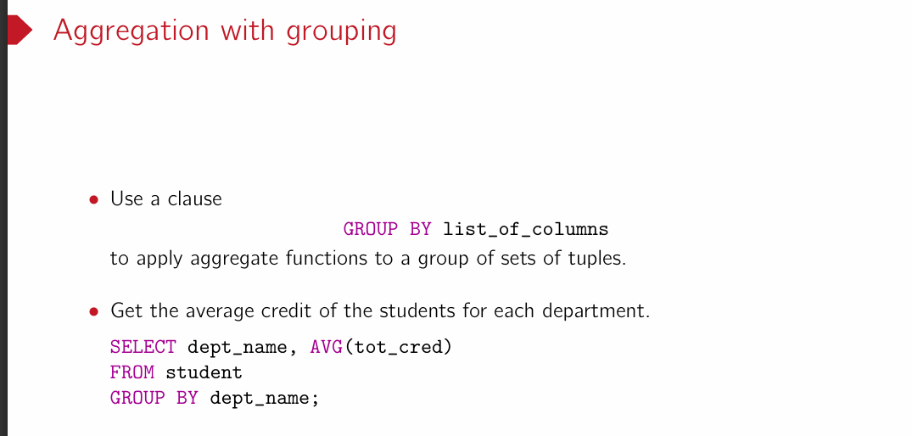

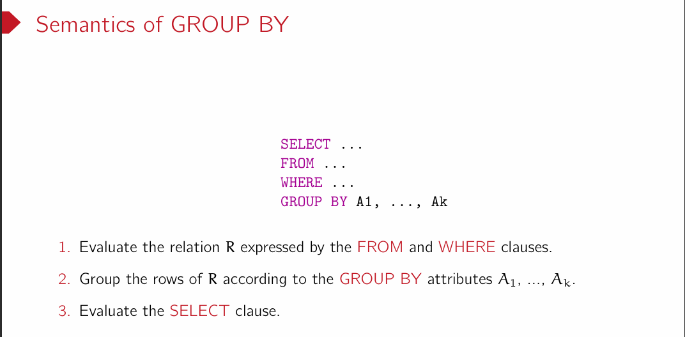

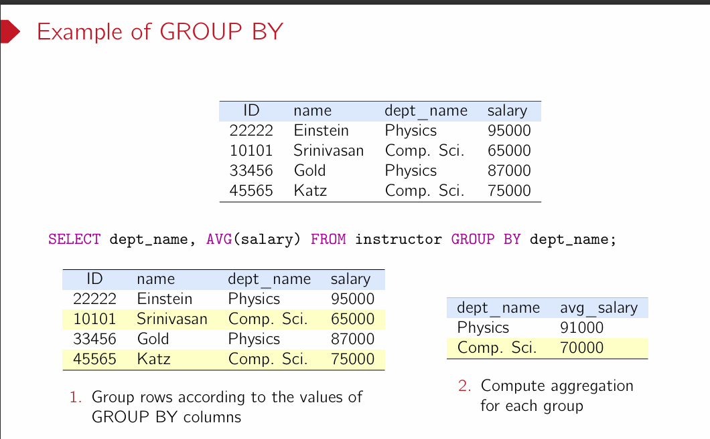

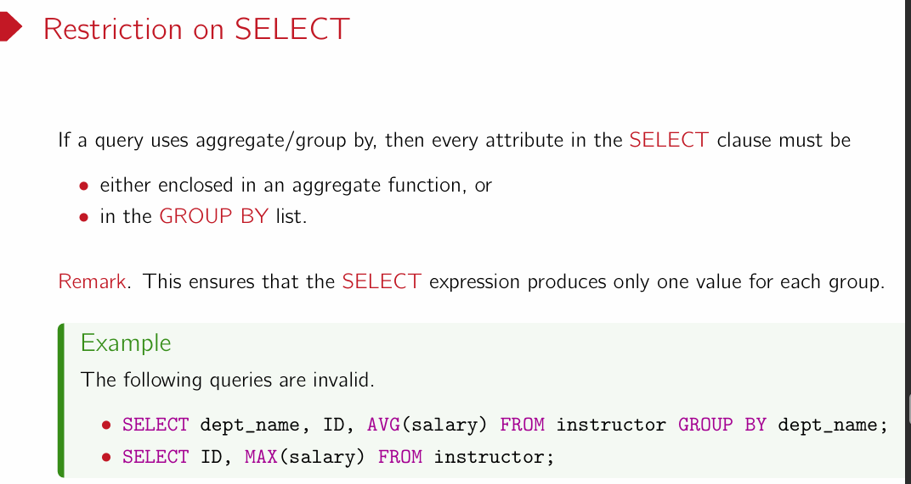

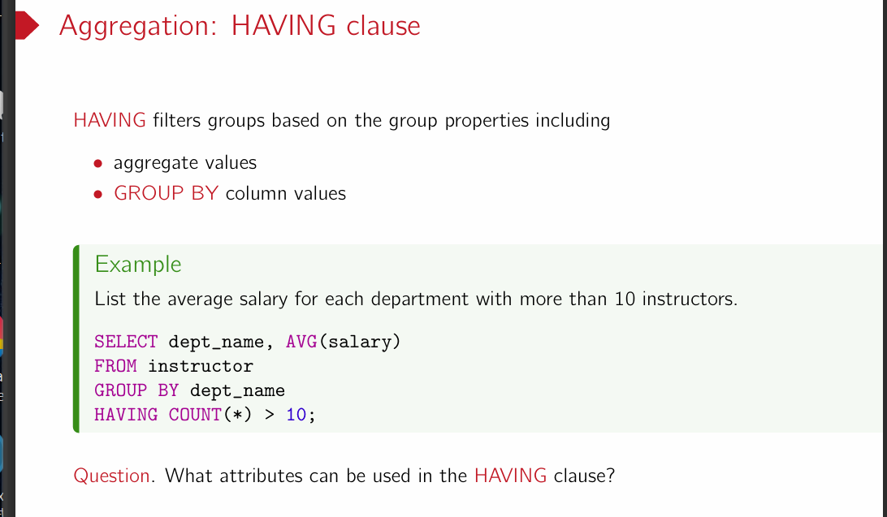

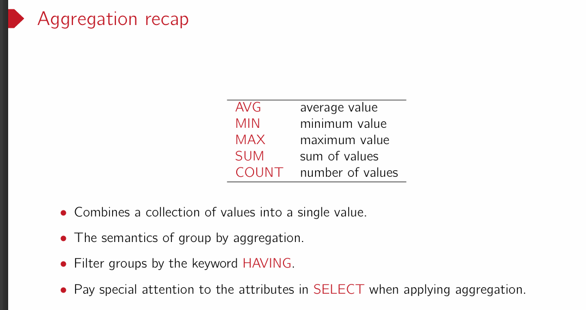
