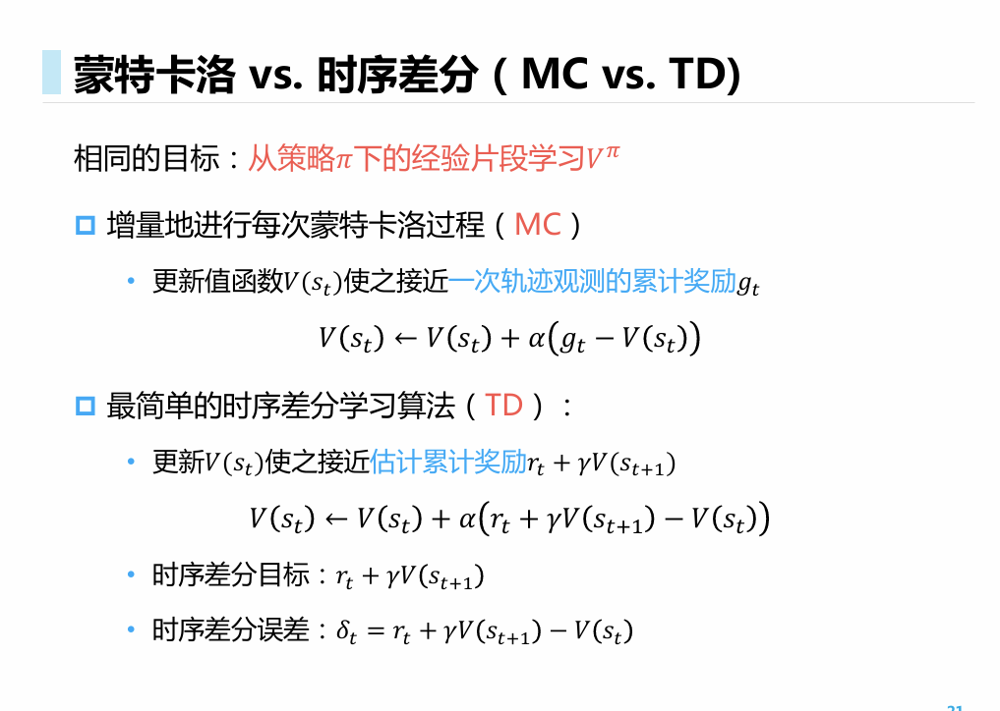

基于环境的模型强化学习： 具身智能--多模态nero 基于sim的做planning

目标策动的层次化强化学习：（milestone）

模仿学习（现实环境，没有显式的奖励函数）：轨迹--模仿--泛化

太湖机器人（宁德时代）

多智能体强化学习（博弈）新的不确定性--环境非稳态

离线强化学习（offline 数据集）模拟与真实环境的交互效果，直接部署在真实测试环境中（工业环境中需要pretty fine的离线数据集）

large sequential model

有监督学习--预测接下来发生什么

解决样本复杂度的需求（基于模拟环境）

预测往后的encoder和decoder，循环

encoder离散化处理（聚类的token）RNN prediction更好 --> Sequence Model --> 未来Env -- > planning

DreamerV3

改变强化学习的范式 -- 目标 default goal ：maximum argument prediction reward function

具身智能 VRA model 写论文 LLMs -- prompt --Agent

achieve goal1 上层产生goal，下层产生action和新的goal

Imitation Learning： 调goal本身：人为驾驶车辆轨迹数据：policy 不如Experts

逆向学到reward function -- 正向强化学习-- tune --训练（RHLF）

London 做的极致 轨迹数据--逆向强化学习/模仿学习 -- 指导驾驶策略-- action

其他智能体正在学习 - non -stationary（环境也在变，对于每一个智能体而言都在变/博弈）/ dynamic（state tra）

优化过程不适合跨任务泛化/NLP 大sequence model基于范式做泛化

Alpha-go Deepseek

知识连通性 可能超越人（math code prediction/planning embodied）

application：交互环境生成：基于Mov推演 Generate a playable world set in a futuristic)

3D时间建模

application：环境游戏生成（引擎是NN给出的）diffusion google（前后都填空）

application： 聚变反应堆控制（AI4Sci）build a simulator 真实环境会浪费资源且有安全性问题

application：无人机体育竞技（灵活性）

application：控制机器狗跑酷（robot keeps re-trying）基于环境感知+运动控制

云深处--浙大老师/卷宇树（收集数据-模仿学习）

机器人进化速度太快了！

3A校友会博士论坛（动捕--强化学习）软件--全身协调控制

单脚跳--区别：没有任何reference motion，仅基于reward，角度/步态 take action

para 1MLP

VLA model （大脑控制）底层小脑控制

physical intelligence PI 家务

facebook

GPT-4 Technical Report

强化学习在大语言模型的落地 -pretraining loss

SFT/post training

DQN比MLA的创新弱多了

Deepseek 是掀桌子的技术（ML 学者）整个行业都变了

两层黑盒（环境的非稳态）

token（state 就叠一个token）

博士涉及强化学习 则被HR安排完了

探索未知环境产生新的数据和决策

Agent== LLM + interaction from fine-tuning + 交互环境（与调prompt无关）

探索与利用

强化学习的data来自于环境和智能体的交互/Agent 等级比较高/interaction产生新的知识 trade-off

舒适区（利用最大化但不容易以最高速率变强）

过于探索则不容易持续变强（policy没达到一定水平，策略的space是高维的）

T型人才：视野宽，某一领域精深

多臂老虎机（multi-armed bandit）问题的形式化描述

online learning

无state，只有认知（information state） 对于R（reward）的认知

背后有具体的二进制的（average reward是在很多次探索之后发现的）

which arm to take

懊悔值（相比于最优的收益的差）

trade-off sublinear regret 下界是log t

distribution很接近，则更难区分出来

ε -greedy

认知被贪心所限制 regret增长是linear的

ε -greedy policy to uniform / 积累了稳定的regret -- 衰减regret（exploration）

Naive method

New：早期

不确定性的测度

Standard Deviation

Sub-linear regret

采样范式一致

IsaacGym-based Projects

​	RMA On quadrupeds 宇树的AE 在不同条件下进行行走（滑地）

​	Humanoid Locomotion 

PSRO -- Paper

第八周周五 逸夫楼

马尔科夫决策过程，

基于动态规划的强化学习

基于模型的强化学习

MDP

序列的全序

Bandit 

有状态转移 -- dynamic

action 改变了data distribution

intractable 导不出来

DRL 和 data distribution两层黑盒

不是一个normalization 要乘以一个（1-γ）

合法占用度量：transition

unnormalized期望Expectation的情况下在Π的策略下Reward的分布

找一个最好的Π，J（Π）最大

Bellman Equation

策略提升是RL的基础架构；Policy-Gradient

Week3 2025/03/03

DP是对MDP的极致求解，Transition的极小错误做Bellman迭代的时候放得很大。dynamic programming 会导致error传遍MDP；我不学MDP，而直接从MDP

无偏的但variance极大

## Week3 2025.3.7

MC是无偏算法；

估计价值函数---提升策略本身

sample的时候会遗漏到其他点 -- 强化学习的tradeoff 尽可能采取最优策略

estimate 最优值函数 -- V函数策略/Q函数策略

无模型控制方法

基于V函数

在强化学习（Reinforcement Learning，RL）中，理解 $Q$ 函数与 $V$ 函数是非常关键的，它们共同构成了强化学习算法评估策略和选择行为的核心。

------

## 一、强化学习中的两个关键概念：V函数与Q函数

### 1. 状态值函数（State Value Function，简称V函数）

- **定义**： 状态值函数 $V^\pi(s)$ 表示在策略 $\pi$ 下，从当前状态 $s$ 出发，长期来看所能获得的期望累积回报。

  数学定义如下：

$V^\pi(s) = \mathbb{E}_\pi\left[ \sum_{t=0}^{\infty}\gamma^t r_{t+1} | s_0 = s \right]$

- **直观理解**： V函数衡量了**在特定策略 $\pi$ 下**，从状态 $s$ 出发，未来可能获得的**折扣累积奖励的期望值**。
   换句话说，它告诉我们，处于状态 $s$ 时未来有多“好”。

- **典型更新公式（如图中所示）**：

  以Temporal-Difference（TD）方法为例，更新公式为：

  V(st)←V(st)+α(rt+γV(st+1)−V(st))V(s_t) \leftarrow V(s_t) + \alpha (r_t + \gamma V(s_{t+1}) - V(s_t))

  其中：

  - $\alpha$：学习率
  - $\gamma$：折扣因子（0到1之间），决定了未来奖励对当前价值影响程度的衰减。

------

### 2. 动作值函数（Action Value Function，简称Q函数）

- **定义**： Q函数（动作值函数） $Q^\pi(s,a)$ 表示在特定策略 $\pi$ 下，从状态 $s$ 出发，采取动作 $a$ 后，能够得到的长期累计回报期望：

  Qπ(s,a)=Eπ[∑t=0∞γtrt+1∣s0=s,a0=a]Q^\pi(s,a) = \mathbb{E}_\pi\left[\sum_{t=0}^{\infty}\gamma^t r_{t+1}|s_0 = s,a_0=a\right]

- **直观理解**： Q函数告诉我们在特定状态下，选择某个特定动作 $a$ 的价值。与状态值函数不同的是，Q函数不仅关注状态，还显式关注了选择的动作。

------

## 二、V函数与Q函数的关系与区别

| 对比项     | V函数（状态值函数）                            | Q函数（动作值函数）          |
| ---------- | ---------------------------------------------- | ---------------------------- |
| 关注对象   | 状态 $s$                                       | 状态 $s$ 和动作 $a$          |
| 信息完整性 | 只告诉你状态好不好，不直接告诉你该采取什么动作 | 给出具体执行某个动作后的价值 |
| 使用场景   | 用于评估策略的整体价值                         | 更直接用于选择动作           |
| 表达形式   | $V(s)$                                         | $Q(s,a)$                     |

------

## 三、如何利用V函数和Q函数进行决策？

### 1. 基于V函数进行决策（需要模型）

当拥有环境转移概率 $P_{sa}(s')$ 的知识（环境模型）时，可以从V函数中推导最佳策略 $\pi(s)$：

$\pi(s) = \arg\max_{a\in A}\sum_{s' \in S} P_{sa}(s')V(s')$

也就是说，选择一个动作 $a$，它在所有可能的下一状态 $s'$ 的价值 $V(s')$ 经过环境转移概率 $P_{sa}(s')$ 的加权后，综合价值最大。

这种方法叫做**基于模型（Model-based）的决策方法**，因为它需要知道环境的动态（转移概率）。

### 2. 基于Q函数进行决策（无模型）

如果你不知道环境的模型（即转移概率未知），那么需要一个动作值函数 $Q(s,a)$，然后直接选择价值最大的动作：

$\pi(s) = \arg\max_{a \in A} Q(s,a)$

这种方法更加实用，因为它不要求事先知道环境的具体转移概率，因此被广泛应用在Q-learning或深度强化学习（如DQN）算法中。

------

## 四、具体应用举例（Q-learning）

例如在Q-learning中，更新Q函数的规则为：

$Q(s_t,a_t) \leftarrow Q(s_t,a_t) + \alpha[r_t + \gamma \max_{a'}Q(s_{t+1}, a') - Q(s_t,a_t)]$

与V函数更新的最大不同是：

- **Q函数**关注具体的动作和状态对 $(s,a)$，直接决策动作，无需已知环境模型。
- **V函数**仅关注状态值 $V(s)$，通常用于已知环境模型或策略评估。

------

## 四、实际选择用V还是Q函数？

- 若你已知环境转移概率（如在动态规划的环境中），则计算V函数较为方便。
- 在大部分现实场景中，环境模型（转移概率 $P_{sa}(s')$）是未知的，因此更普遍的做法是使用**Q函数**来直接估计动作价值，进而进行决策。

------

## 小结：

- **V函数**适合于有模型（即环境的动态变化已知）的情况下进行长期价值评估。
- **Q函数**更适用于未知模型环境，直接从数据中学习状态-动作的长期价值，并直接指导动作选择，因此在实际强化学习应用中更常用（例如经典的DQN、DDPG、Deep Reinforcement Learning中广泛使用Q函数）。

图中展示的是强化学习（Reinforcement Learning, RL）中经典的**SARSA算法**（State-Action-Reward-State-Action），属于一种典型的**在线策略（on-policy）时序差分（TD）算法**。

下面将详细解释其基本思想、具体过程、适用场景，并对其效率做出批判性的思考：

------

## 📌 一、什么是 SARSA 算法？

**SARSA** 是强化学习领域中一种用于估计**动作价值函数 $Q(s,a)$** 的在线（on-policy）学习算法，属于时序差分（TD）方法中的一种。

算法名称 “SARSA” 来源于每一步所经历的顺序：

- 状态 $S$
- 动作 $A$
- 奖励 $R$
- 下一状态 $S'$
- 下一步动作 $A'$

------

## 二、SARSA 算法的核心思想与流程

SARSA算法在每个回合（episode）中，执行以下步骤：

1. **初始化 Q 值表 $Q(s,a)$**，所有状态-动作对的值任意设置（通常为0）。

2. 对于每个回合（episode），依次执行：

   - 初始化环境状态 $S$。
   - 根据当前策略 $\pi$（如 $\epsilon$-贪心）选择一个动作 $A$。
   - 执行动作 $A$，获得即时奖励 $R$ 和下一个状态 $S'$。
   - 根据同一个策略 $\pi$ 再次选择下一个动作 $A'$。
   - 按照下面的公式更新Q函数：

   Q(S,A)←Q(S,A)+α[r+γQ(S′,A′)−Q(S,A)]Q(S,A) \leftarrow Q(S,A) + \alpha \left[ r + \gamma Q(S',A') - Q(S,A)\right]

   - 将状态与动作更新：$S \leftarrow S'$, $A \leftarrow A'$

3. 一直重复上述过程直到状态达到终止状态（terminal）。

------

## 🔍 核心概念与深入理解：

### （一）为什么称为 on-policy（在线策略）？

- **on-policy（在线策略）** 指的是：
  - 生成数据（选择动作）与评估或优化策略**使用同一个策略**。
  - 通俗点讲，你边学边用，用当前策略来选择动作，并同时用这些动作的结果更新和优化你的策略。
- SARSA正是如此：
  - 在学习过程中，下一步动作 $A'$ 也是根据当前正在学习的策略来选择的（如 $\epsilon$-贪婪策略）。
  - 因此，它更新Q函数时使用的都是实时根据策略实际采样到的动作和状态。

------

## 相较于其他算法的特点与区别：

- 与 

  Q-learning

  （off-policy算法）不同：

  - Q-learning不论当前策略如何，总是用下一个状态 $S'$ 上的**最佳动作（贪婪动作）\**来更新，因此称为\**off-policy**。
  - SARSA使用实际下一步采取的动作来更新，因此更加保守和安全一些。

| 算法 | 学习类型 | 使用数据 | 探索特性 | 适用场景 | |-------|-------------| --------- | ------ | | SARSA | on-policy | 边学习边行动，策略和行为是一致的 | | Q-learning | off-policy | 总使用最优动作更新，与当前策略无关 |

------

## SARSA 算法直观解释：

### 算法流程（举例说明）：

假设一个机器人在迷宫中寻找出口：

- 机器人处于当前状态 $S$，根据现有的策略选择了动作 $A$（比如向左）。
- 执行动作 $A$，收到奖励（reward）$R$，环境变为新的状态 $S'$。
- 然后机器人再根据当前策略（可能随机或$\epsilon$-贪心）选择下一个动作 $A'$。
- 机器人将 $(S, A, R, S', A')$ 这五个信息整合更新 $Q$ 表。
- 下一步执行动作 $A'$，循环往复。

### 算法关键特征：

- **“所学即所用”**：边学边用，实时学习。
- 对于环境的探索是基于当前策略实际执行的动作序列，而非理论上的最优动作。因此，它对所经历数据的利用率低于off-policy方法（如Q-learning），但在更真实的环境交互中更安全。

------

## 实际应用价值与不足：

### SARSA 的优势：

- 适用于**对安全性敏感**的问题（例如机器人导航），因为它考虑到探索时真实选择的动作带来的风险。
- 适用于**数据实时更新**的场景，因为它是在线学习算法。

### SARSA 的缺点：

- 数据利用率低，因为它不能重用非当前策略生成的数据（off-policy则可以）。
- 收敛速度通常慢于Q-learning，且收敛到的策略可能不如 Q-learning 的结果好（次优策略）。

### 应用领域：

- 机器人控制（更谨慎的决策）
- 在线游戏策略
- 实时决策控制系统

------

## 总结：

- SARSA算法属于**在线策略（on-policy）时序差分（TD）控制算法**。
- 每次行动所用策略和更新Q值函数使用的是同一个策略（如$\epsilon$-greedy）。
- 更新公式体现了真实交互过程（更谨慎），而不是理想化地使用最优动作。
- 与Q-learning相比，更安全但可能产生次优解。

理解 SARSA 算法，可以更深刻地领悟强化学习决策与学习机制间的紧密联系。继续探索吧，你已经迈出了非常关键的一步！

下面详细解释强化学习中的经典算法——**Q-learning 算法**，结合你上传的图片中给出的关键概念：

------

## 📌 一、Q-learning 算法概述

Q-learning是一种经典的强化学习（Reinforcement Learning）算法，主要用于估计**最优动作价值函数** $Q(s,a)$。
 它的目标是从与环境交互过程中获得的数据中学习到一个**最优策略**，使智能体能在每个状态选择最优的动作，获得最高的长期累计奖励。

- 类别

  ：

  - 属于**离线策略（off-policy）算法**。

- 核心思想

  ：

  - 通过最大化动作值函数 $Q(s,a)$，在探索未知环境的同时，逐步接近最优策略。

------

## 📌 二、核心概念介绍

图片中给出了Q-learning的核心思想和公式，让我们逐步理解：

### （一）动作值函数 $Q(s,a)$

- 动作值函数 $Q(s,a)$ 表示在某一状态 $s$ 下采取动作 $a$ 所能获得的期望累计奖励，定义为：

$Q(s_t,a_t) = \sum_{t=0}^{T}\gamma^t r(s_t,a_t)$

其中：

- $s_t$ 是当前状态。
- $a_t$ 是当前采取的动作。
- $r(s_t,a_t)$ 是当前状态采取动作后的即时奖励。
- $\gamma$ 是折扣因子（0到1之间），用于权衡即时奖励和未来奖励的重要性。

------

### （二）Q-learning 递推公式

Q-learning算法的核心是利用 **Bellman方程** 进行迭代更新：

$Q(s_t,a_t) \leftarrow Q(s_t,a_t) + \alpha\left[ r(s_t,a_t) + \gamma \max_{a'}Q(s_{t+1}, a') - Q(s_t,a_t) \right]$

- $\alpha$ 是学习率，用于控制每次更新Q值的幅度。
- $\gamma$ 为折扣因子。
- $\max_{a'} Q(s_{t+1},a')$ 代表了从下一状态出发所有可能动作中最好的那个动作的估值。

此公式的直观解释是：

> **当前状态-动作对的价值 = 当前价值 + 学习率 ×（立即奖励 + 下一状态的最优动作价值 - 当前估计价值）**

- 通过这种方式，不断**向未来更好的状态-动作对的价值靠近**，逐步优化策略。

------

### （三）Off-policy（离线策略）含义

- 离线策略（off-policy）：
  - 是指用于评估或优化的策略（目标策略），和实际用于生成数据的策略（行为策略）并不需要相同。
  - Q-learning 利用离线策略的好处在于：
     它不需要当前采用的动作都是最优的，可以利用任意策略（比如随机策略）进行探索环境，但在更新 $Q$ 值时总是假设下一步选择最优动作（$a'$），以此不断逼近最佳策略。
- 这种策略的最大优势是数据**利用效率更高**，之前探索的数据可以重复利用，避免了数据浪费（与SARSA算法相对）。

------

## 📌 三、Q-learning 算法执行流程

Q-learning 的典型执行步骤：

1. 初始化所有状态-动作值 $Q(s,a)$，通常设置为0或任意值。

2. 对每个回合（episode）进行：

   - 初始化状态 $s$。

   - 反复执行以下步骤，直到到达终止状态：

     - 在状态 $s$ 下，使用行为策略（例如 $\epsilon$-greedy）选择动作 $a$。
     - 执行动作 $a$，观察奖励 $r$ 和下一状态 $s'$。
     - 根据公式更新 Q 值：

     Q(s,a)←Q(s,a)+α[r+γmax⁡a′Q(s′,a′)−Q(s,a)]Q(s,a) \leftarrow Q(s,a) + \alpha [r + \gamma \max_{a'}Q(s',a') - Q(s,a)]

     - 状态转移 $s \leftarrow s'$。

3. 重复上述过程，直到算法收敛或达到预设的迭代次数。

------

## 📌 四、Q-learning 算法的优缺点分析

### ✅ 优势：

- 高效的数据利用

  ：

  - Off-policy 特性允许 Q-learning 重复使用之前的数据，加快学习速度。

- 保证最优策略收敛

  ：

  - 在满足一定条件下（如所有状态-动作对被无限次探索，学习率逐渐减小），Q-learning 保证收敛到最优策略。

- 实现简单易理解

  ：

  - 算法结构清晰，便于实现和扩展（如 DQN 深度强化学习算法）。

### ❌ 缺点：

- 策略过于激进

  ：

  - 因为更新采用了最优的动作选择，可能忽视一些探索的风险，现实环境中容易造成冒险行为。

- 初始学习阶段震荡

  ：

  - 在学习初期，Q值变化剧烈，可能导致不稳定。

------

## 📌 五、与 SARSA 算法的对比

| 特点         | SARSA（on-policy）         | Q-learning（off-policy） |
| ------------ | -------------------------- | ------------------------ |
| 学习策略类型 | 在线策略                   | 离线策略                 |
| 动作选择方式 | 使用当前策略实际选择的动作 | 总是假设选择最佳动作     |
| 数据利用率   | 较低，每次数据仅用一次     | 较高，可重复使用数据     |
| 决策风格     | 保守、安全                 | 激进、趋于最优           |
| 收敛速度     | 一般慢一些                 | 较快                     |

- Q-learning更注重寻找理论上的最优解，可能忽略安全性。
- SARSA 更加谨慎，稳健但可能获得次优策略。

------

## 📌 六、实际应用领域

Q-learning广泛应用于：

- 自动控制与机器人路径规划
- 游戏AI（如Atari游戏）
- 自动驾驶决策
- 推荐系统

Q-learning算法被深度强化学习（如DQN）广泛使用，已取得了广泛的成功和广泛的工业应用。

------

## 📌 七、总结：

- **Q-learning 是一种经典的 off-policy 算法**，能够高效地利用数据，通过不断迭代动作价值函数来逼近最优策略。
- Q-learning的核心是利用**Bellman最优方程**进行迭代更新。
- 尽管Q-learning的理论和实际表现非常强大，但它也存在过于激进、初期震荡的问题。
- 在实际应用中，常常通过**探索-利用平衡策略**（如$\epsilon$-greedy）来缓解这些问题，使算法更加稳定。

理解 Q-learning 为深入学习更复杂的强化学习算法（如DQN、DDPG、A3C等）提供了必要的基础，加油！

GAE: General Average Estimate 就是n步的时序差分

on-policy SASRA

off-policy Q-learning

# Global LLM configuration
[llm]
model = "gpt-4o"
base_url = "https://api.openai.com/v1"
api_key = "sk-..."  # Replace with your actual API key
max_tokens = 4096
temperature = 0.0

# Optional configuration for specific LLM models
[llm.vision]
model = "gpt-4o"
base_url = "https://api.openai.com/v1"
api_key = "sk-..."  # Replace with your actual API key